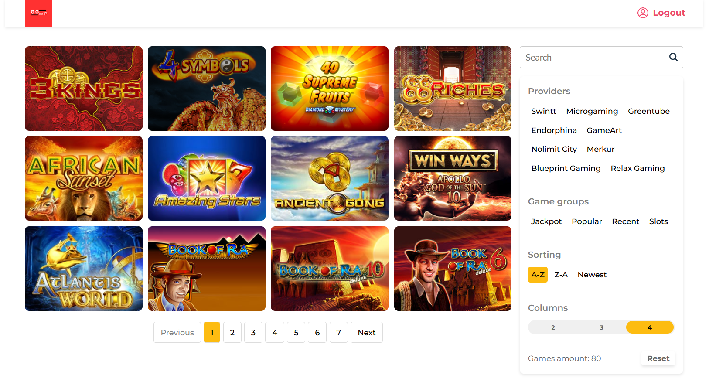

# Gaming platform



## Installation

Instructions on how to install and set up your project.

## Running the Application

To run the application, follow these steps:

1. Install dependencies for all parts of the project:
   ```
   npm run install:all
   ```

2. Start the server:
   ```
   npm run start:server
   ```

3. In a new terminal, start the client:
   ```
   npm run start:client
   ```

The server will start running, and the client will be available at the URL provided in the terminal (typically http://localhost:5173 if you're using Vite as your development server).

## Logging In

You can log in to the application using the following test accounts:

- Username: player1, Password: player1
- Username: player2, Password: player2
